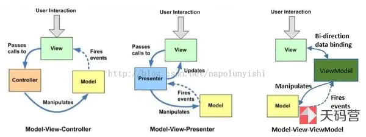

> 目前主流的APP的常用架构有**`mvc`**、**`mvp`**、**`mvvm`**

如下图：

1、**`mvc`**架构我们已经耳熟能详：

* **`m`**（模型）：负责数据请求，模型解析等
* **`v`**（视图）：负责数据展示，事件发送等
* **`c`**（控制器）：负责整体的视图展示，逻辑控制等等

>  随着项目越来越大，维护成本页越来越高。比如某次的需求改版，一个`vc`里有超**2000**行代码的情况，并不少见。笔者不知道你们怎么认为，反正我是觉得很**恶心**。

使用流程：

* C引用着V与M
* M负责请求接口以及数据解析
* 成功后将数据赋予V进行展示

2、**`mvp`**架构

* 相同点就不在重复介绍
* **`p`**：Presenter，与`mvc`最主要的异同点在于：V与M并不直接交互，而是通过与中间件Presenter进行交互

使用流程：

* VC引用着V与P，则P引用着M并且弱引用着V
* 当V发出事件后，首先与P交互，P驱动M更新数据，M更新完成数据之后，回调给P
* P通过回调，驱动着V更新等等

3、**mvvm**其实在前面有介绍过，详细请见[app常用架构之mvvm](https://github.com/MrDeveloperLiu/Blog/blob/master/knowledge/mvvm.md)

* 最终实际上是由**`p`**演进而来的**`vm`**：ViewModel
* ViewModel实际上由P与V的数据共同构成

使用流程：

* VC引用着V，V引用着VM，则VM负责与V进行双向绑定
* 当V触发`event`时，VM触发M的更新数据，M更新数据后，回调给VM
* VM由于拥有的V的数据层，数据层与V拥有绑定关系，则驱动着V的更新

