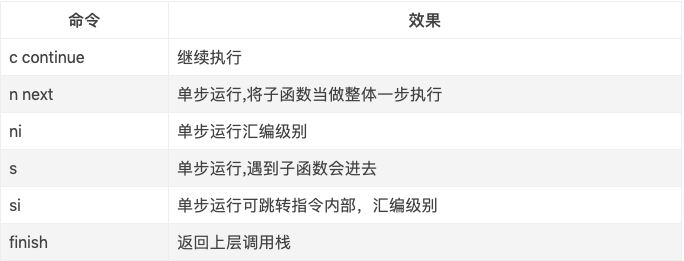

#### breakpoint

* 来给某函数设置断点`breakpoint set -n 某函数名`

* 打印出断点列表`breakpoint list` 

* 如果想一次性来设置多个断点 `breakpoint set -n 某函数名, -n 某函数名, -n 某函数名……`

* 删除所有上次设置的断点`breakpoint delete`
* 将设置过的断点禁用`breakpoint disable 断点id`
* 遍历整个工程；只要含该字符串的方法、函数都会下断点`breakpoint set -r “字符串”`
* 给该类名的具体行数加断点 `breakpoint set -f 类名 -l 断点行数`
* 给该类名的具体方法加断点`breakpoint set -file 类名 --selector 方法名`
* 断点之后执行相应的组合命令以`DONE`结束`breakpoint command add 断点id`

#### 断点的控制流程

* 启用、禁用`breakpoint enable/disable`
* 继续执行`continue`
* 执行下一步`next`
* 进入方法`step`
* 跳出方法`finish`

#### 打印语句

* 动态执行语句,可以查看基本数据的类型值, 如果用p命令查看的是对象的话, 只会返回对象的指针地址, p后面可以接变量、常量还可以接表达式`p`
* 打印对象的desc信息, 打印对象`po`
* 和p语句意思是一样的 `expression`

#### 堆栈操作

* 查看堆栈`bt`
* 堆栈选择`frame select id`
* 查看参数`frame variable`
* 向上下查看`up/down`

#### 线程信息

* 输出当前的线程`thread info`
* 不再执行下面的代码`thread return`
* 查找崩溃信息`image lookup -address 地址`
* 查看方法的来源`image lookup -name 方法`
* 查看成员,可以查看某个类class的所有成员变量以及属性`image lookup -type 类 `

本文摘自：[链接](https://www.cnblogs.com/guohai-stronger/p/11940433.html)