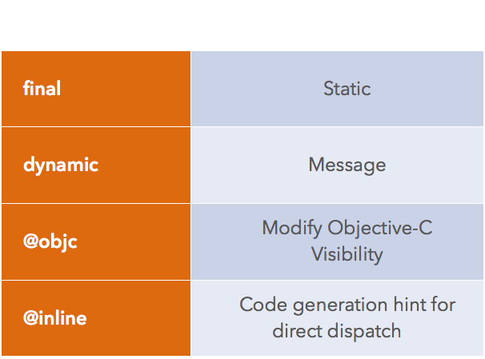
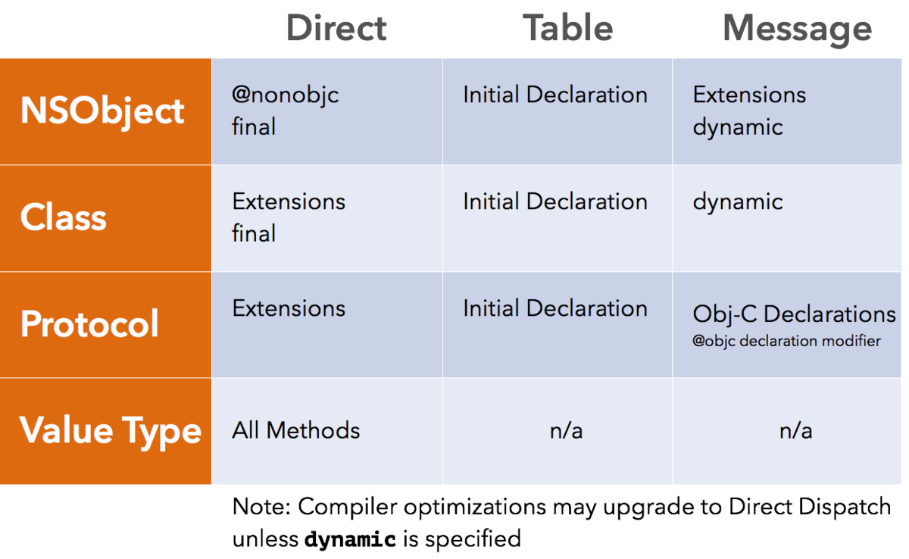

>   由于笔者最近一直在用`Swift`写项目，实际上也属于一个开发小白，初次使用的一周，很多东西都感觉上手比较困难；为什么这么说呢，你想写个框架用一用，都会被诸多语法限制，而且与`Objective-C`不一样的地方太多。
>
>   大概`ObjC`底层大量使用**C语言编写**，然鹅可能`Swift`底层基于**C++语言**居多而导致的吧（这是笔者的猜测）
>

## 为什么这么猜测

  我们来回忆一下`ObjC`的`类`的概念：一切类皆指针，比如一个`NSObject`类，实际上是个`struct objc_object *`类型的指针，而最底层的`runtime`系统也是基于C语言api来实现的。

  还有一个猜测点：`Swift`中的泛型，可谓比起`Objc`来说它的泛型更加类似于`C++`，而`Objc`的泛型，怎么都觉得有点假而已（因为即使你传入的并非泛型参数，编译也能通过，估计很大一部分原因得益于，语言特性：运行时检查吧）

  当然，以上观点纯属于个人猜测，如有不正确的地方，还请大神们指出

## 进入正题

  本文我们主要讨论的问题是：Swift的函数派发；原文链接在这里[Swift的函数派发](https://www.jianshu.com/p/95d8f1cf05bf)

```
那么在进入讨论之前：我们需要明确几个概念
1、静态派发：编译器直接找到相关指令的位置；当函数调用时，系统直接跳转到函数的内存地址执行操作
2、函数表派发：函数表使用了一个数组来存储类声明的每一个函数的指针，大部分语言把这个称为 “virtual table”(虚函数表)，Swift 里称为 “witness table”；每一个类都会维护一个函数表，里面记录着类所有的函数，如果父类函数被重载的话，表里面只会保存被重载之后的函数；一个子类新添加的函数，都会被插入到这个数组的最后
3、消息机制派发：参考Objc的消息发送机制；这种机制极具动态性，既可以通过swizzling修改函数的实现
```

> 顺便：我们普及一下`Swift`的一些基础的小知识
>
> * `值类型`：struct，enum
> * `引用类型`：class
> * `协议拓展`：swift开发中，我们不仅仅可以给值类型，引用类型添加拓展，就连协议也可添加拓展（这点上，很牛x）

## 默认派发机制


那么总结一下：在默认情况下

* 1、值类型与其拓展使用静态派发
* 2、协议的声明使用函数表派发，协议的拓展使用静态派发
* 3、`swift`的`class`的声明使用函数表派发，`class`的拓展使用静态派发
* 4、`NSObject`的类声明使用函数表派发，`NSObject`的拓展使用消息机制派发

## 关键字指定派发方式



* 1、`final`：允许类里面的函数使用直接派发，这个修饰符会让函数失去动态性；同时也会让 Objective-C 的运行时获取不到这个函数，不会生成相应的 selector
* 2、`dynamic`：可以让类里面的函数使用消息机制派发；dynamic 可以让声明在 extension 里面的函数能够被 override
* 3、`@objc`或者`@nonobjc`：都可以显式地声明了一个函数是否能被 Objective-C 的运行时捕获；使用 @objc 的典型例子就是给 selector 一个命名空间 @objc(abc_methodName)，让这个函数可以被 Objective-C 的运行时调用；@nonobjc会改变派发的方式，可以用来禁止消息机制派发这个函数，不让这个函数注册到 Objective-C 的运行时里
* 4、`@inline`：Swift 也支持 @inline，告诉编译器可以使用直接派发

## 总结



